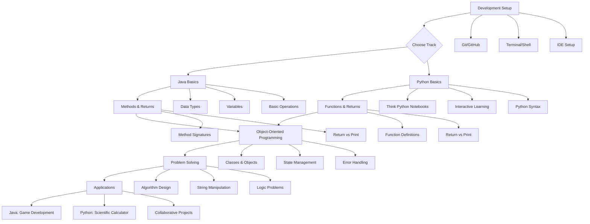
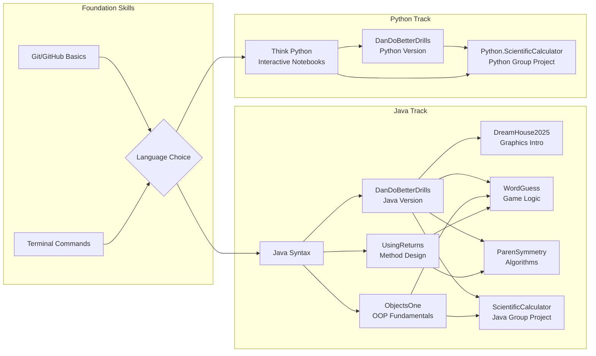
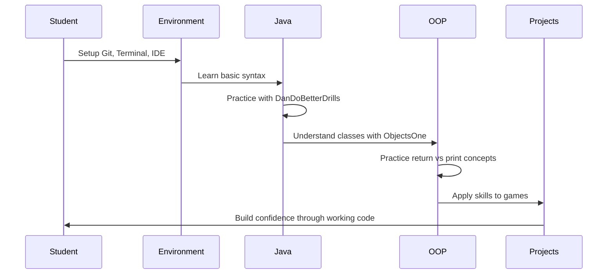
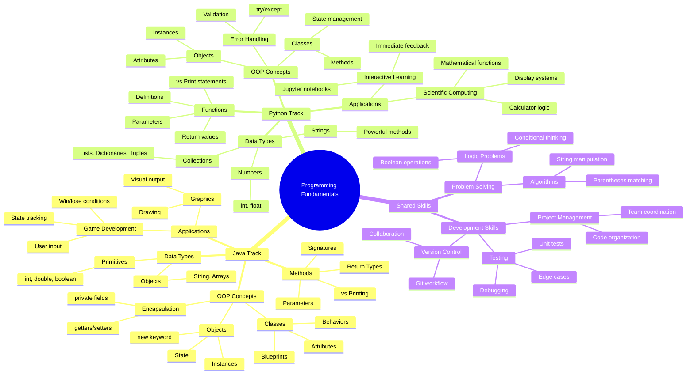

# ZipCode Week 1 Learning Progression

## Learning Path Overview - Java & Python Tracks

## Project Dependencies & Skills - Java & Python Tracks

## Skill Building Sequence

## Concept Relationships - Dual Track Programming

## Python Learning Progression Notes

### **Foundation Phase (Week 1)**
**Think Python Resource** - Complete beginner introduction using interactive Jupyter notebooks
- Variables, functions, conditionals, loops
- Data structures: Lists, dictionaries, tuples  
- Interactive learning environment with immediate feedback

### **Skill Building Phase**
**DanDoBetterDrills (Python Version)** - Parallel exercises to Java version
- String manipulation using Python's powerful string methods
- Boolean logic with Python's True/False and logical operators
- Mathematical operations with Python's numeric types
- Function implementation and understanding Python functions vs Java methods

### **Application Phase (Weekend Project)**  
**Python Scientific Calculator** - Advanced project focusing on:
- Object-oriented programming: Classes, state management, encapsulation
- Error handling: try/except blocks, input validation
- Advanced mathematical functions: Trigonometry, logarithms
- Display systems: Binary, octal, decimal, hexadecimal conversion
- Comprehensive testing: Unit tests, edge cases, descriptive naming
- Collaborative development: Git workflow, team programming

### **Key Differences from Java Track**
- **Interactive Learning**: Jupyter notebooks provide immediate feedback
- **Simplified Syntax**: Python's more readable syntax reduces cognitive load
- **Focus on Logic**: Less boilerplate code allows focus on problem-solving
- **Scientific Computing**: Calculator project introduces mathematical libraries
- **Collaborative Emphasis**: Both tracks emphasize teamwork and version control